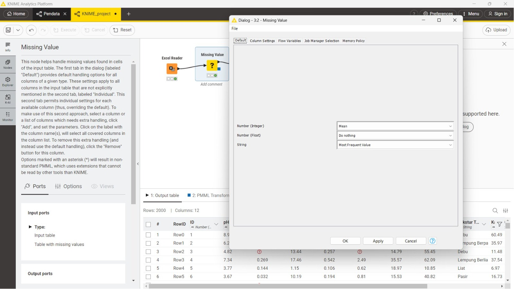
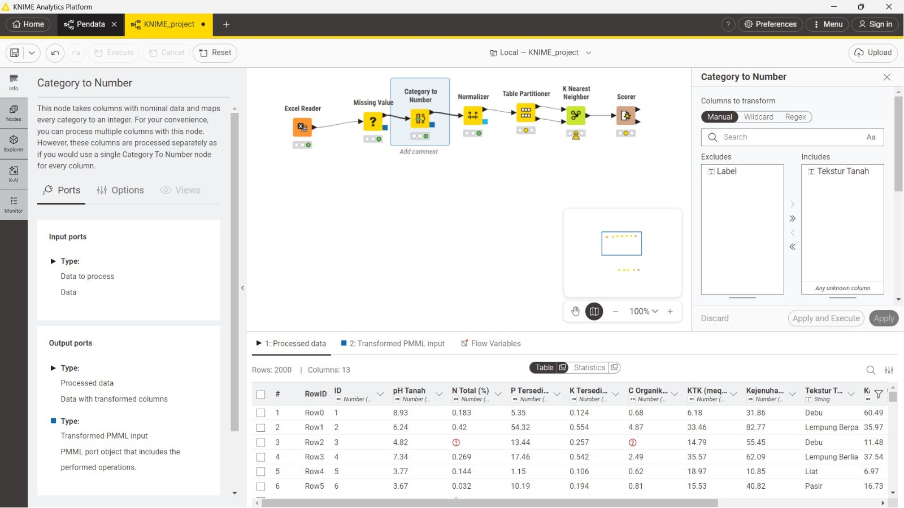
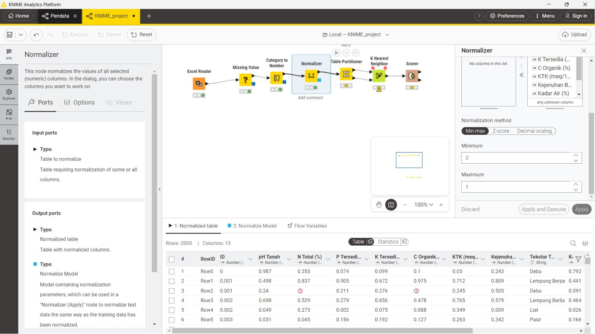
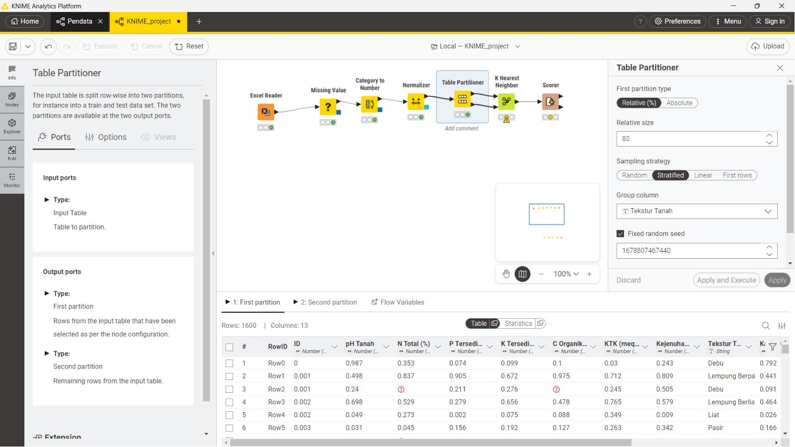
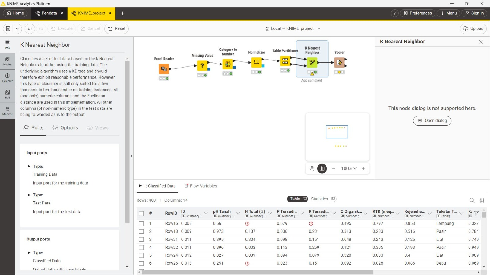
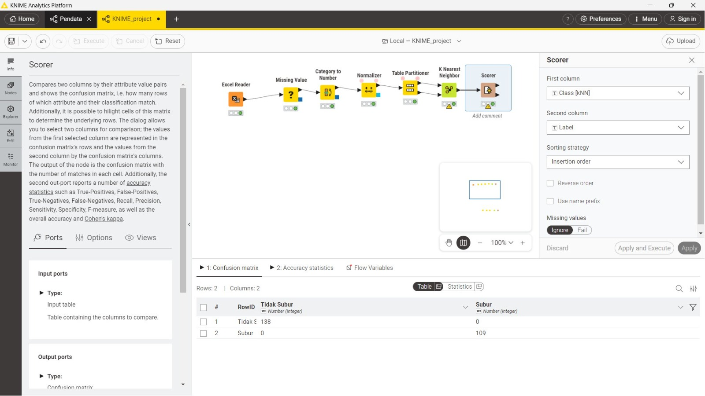

# Laporan Analisis Kesuburan Tanah Menggunakan Metode K-Nearest Neighbor (KNN) di KNIME Analytics Platform

**Mata Kuliah:** Penambangan Data  
**Topik:** Analisis Kesuburan Tanah  
**Tools:** KNIME Analytics Platform  
**Metode:** K-Nearest Neighbor (KNN)  

---

## Daftar Isi

1. [Gambaran Umum Alur Kerja (Workflow)](#1-gambaran-umum-alur-kerja-workflow)
2. [Node 1: Excel Reader – Pembacaan Dataset](#2-node-1-excel-reader--pembacaan-dataset)
3. [Node 2: Missing Value – Penanganan Nilai yang Hilang](#3-node-2-missing-value--penanganan-nilai-yang-hilang)
4. [Node 3: Category to Number – Konversi Data Kategorikal](#4-node-3-category-to-number--konversi-data-kategorikal)
5. [Node 4: Normalizer – Normalisasi Data](#5-node-4-normalizer--normalisasi-data)
6. [Node 5: Table Partitioner – Pembagian Data Latih dan Uji](#6-node-5-table-partitioner--pembagian-data-latih-dan-uji)
7. [Node 6: K Nearest Neighbor – Klasifikasi KNN](#7-node-6-k-nearest-neighbor--klasifikasi-knn)
8. [Node 7: Scorer – Evaluasi Model](#8-node-7-scorer--evaluasi-model)
9. [Kesimpulan](#9-kesimpulan)

---

## 1. Gambaran Umum Alur Kerja (Workflow)

Proyek analisis kesuburan tanah ini dibangun menggunakan KNIME Analytics Platform dengan alur kerja (workflow) yang terdiri dari tujuh node yang saling terhubung secara berurutan. Alur kerja ini dirancang untuk mengklasifikasikan kesuburan tanah ke dalam dua kategori, yaitu **"Subur"** dan **"Tidak Subur"**, menggunakan algoritma K-Nearest Neighbor (KNN).

Secara keseluruhan, alur kerja berjalan dari kiri ke kanan sebagai berikut:

```
Excel Reader → Missing Value → Category to Number → Normalizer → Table Partitioner → K Nearest Neighbor → Scorer
```

Setiap node memiliki peran masing-masing dalam proses penambangan data, mulai dari pembacaan data mentah, pra-pemrosesan (preprocessing), pembangunan model, hingga evaluasi kinerja model klasifikasi.

---

## 2. Node 1: Excel Reader – Pembacaan Dataset

### Deskripsi Node

Node pertama dalam alur kerja ini adalah **Excel Reader**. Node ini berfungsi untuk membaca dan mengimpor file dataset yang tersimpan dalam format Microsoft Excel (`.xlsx`) ke dalam lingkungan KNIME. Node Excel Reader mendukung berbagai format file Excel seperti `.xlsx`, `.xlsm`, `.xlsb`, dan `.xls`. Data yang dibaca akan dikonversi secara otomatis ke dalam tipe data KNIME yang sesuai, seperti `String`, `Integer`, `Long`, `Double`, `Boolean`, `Local Date`, `Local Time`, dan `Local Date&Time`.

### Screenshot KNIME – Node Excel Reader


*Gambar 1: Tampilan Node Excel Reader pada KNIME – menampilkan alur workflow lengkap dan pratinjau data hasil pembacaan file dataset_kesuburan_tanah_missing.xlsx*

### Dataset yang Digunakan

Dataset yang digunakan dalam analisis ini adalah **dataset_kesuburan_tanah_missing.xlsx**, yang berisi data pengukuran parameter tanah dari berbagai sampel. Setelah dijalankan (execute), node ini menghasilkan output tabel dengan spesifikasi sebagai berikut:

- **Jumlah Baris (Rows):** 2.000 baris data
- **Jumlah Kolom (Columns):** 12 kolom

### Struktur Kolom Dataset

| No | Nama Kolom | Tipe Data | Keterangan |
|----|-----------|-----------|-----------|
| 1 | ID | Number (Integer) | Identifikasi unik setiap sampel tanah |
| 2 | pH Tanah | Number (Double) | Tingkat keasaman tanah |
| 3 | N Total (%) | Number (Double) | Kandungan Nitrogen Total dalam tanah |
| 4 | P Tersedia (ppm) | Number (Double) | Kandungan Fosfor tersedia dalam tanah |
| 5 | K Tersedia (meq/100g) | Number (Double) | Kandungan Kalium tersedia dalam tanah |
| 6 | C Organik (%) | Number (Double) | Kandungan Karbon Organik tanah |
| 7 | KTK (meq/100g) | Number (Double) | Kapasitas Tukar Kation tanah |
| 8 | Kejenuhan Basa (%) | Number (Double) | Persentase kejenuhan basa tanah |
| 9 | Tekstur Tanah | String | Jenis tekstur tanah (kategorikal) |
| 10 | Kadar Air (%) | Number (Double) | Kandungan air dalam tanah |
| 11 | Bulk Density (g/cm³) | Number (Double) | Kerapatan massa tanah |
| 12 | Label | String | Kelas target: "Subur" atau "Tidak Subur" |

### Distribusi Label

Dataset ini memiliki distribusi kelas yang **seimbang (balanced)**, yaitu:
- **Subur:** 1.000 data (50%)
- **Tidak Subur:** 1.000 data (50%)

### Contoh Data Awal

Berdasarkan tampilan tabel pada KNIME, berikut adalah beberapa contoh data yang terbaca:

| RowID | ID | pH Tanah | N Total (%) | P Tersedia | K Tersedia | C Organik | KTK | Kejenuhan Basa | Tekstur Tanah | Kadar Air |
|-------|----|----------|------------|------------|------------|-----------|-----|----------------|---------------|-----------|
| Row0 | 1 | 8.93 | 0.183 | 5.35 | 0.124 | 0.68 | 6.18 | 31.86 | Debu | 60.49 |
| Row1 | 2 | 6.24 | 0.42 | 54.32 | 0.554 | 4.87 | 33.46 | 82.77 | Lempung Berpasir | 35.97 |
| Row2 | 3 | 4.82 | *(missing)* | 13.44 | 0.257 | *(missing)* | 14.79 | 55.45 | Debu | 11.48 |

Pada data Row2 (ID=3), terlihat adanya nilai yang hilang (*missing value*) pada kolom N Total (%) dan C Organik (%), yang ditandai dengan simbol merah (⊕) pada tampilan KNIME. Hal inilah yang menjadi dasar perlunya node **Missing Value** pada tahap berikutnya.

---

## 3. Node 2: Missing Value – Penanganan Nilai yang Hilang

### Deskripsi Node

Node kedua adalah **Missing Value**, yang berfungsi untuk menangani nilai-nilai yang hilang (*missing values*) pada dataset. Node ini sangat penting dalam proses pra-pemrosesan data karena algoritma machine learning, termasuk KNN, tidak dapat memproses data yang mengandung nilai kosong.

### Screenshot KNIME – Node Missing Value



*Gambar 2: Tampilan konfigurasi Node Missing Value – menunjukkan pengaturan imputasi berdasarkan tipe data (Number Integer: Mean, Number Float: Do nothing, String: Most Frequent Value)*

### Rincian Missing Value pada Dataset

Berdasarkan analisis dataset, ditemukan nilai yang hilang pada beberapa kolom sebagai berikut:

| Kolom | Jumlah Missing Value |
|-------|---------------------|
| N Total (%) | 160 baris |
| P Tersedia (ppm) | 240 baris |
| K Tersedia (meq/100g) | 140 baris |
| C Organik (%) | 200 baris |
| Kadar Air (%) | 180 baris |
| Bulk Density (g/cm³) | 120 baris |
| Tekstur Tanah | 100 baris |
| **Total** | **1.140 nilai hilang** |

### Konfigurasi Penanganan Missing Value

Berdasarkan screenshot konfigurasi node Missing Value, strategi yang digunakan adalah sebagai berikut:

| Tipe Data | Metode Imputasi | Keterangan |
|-----------|----------------|-----------|
| **Number (Integer)** | **Mean** | Nilai kosong pada kolom bertipe Integer diisi dengan nilai rata-rata kolom tersebut |
| **Number (Float)** | **Do nothing** | Nilai kosong pada kolom bertipe Float dibiarkan apa adanya (tidak diimputasi di level default) |
| **String** | **Most Frequent Value** | Nilai kosong pada kolom bertipe String (kategorikal) diisi dengan nilai yang paling sering muncul |

### Rumus Imputasi Mean

Untuk kolom bertipe numerik yang menggunakan metode **Mean**, rumus yang digunakan adalah:

$$\bar{x} = \frac{\sum_{i=1}^{n} x_i}{n}$$

Di mana:
- $\bar{x}$ = nilai rata-rata (mean) kolom
- $x_i$ = nilai ke-i yang tidak hilang dalam kolom
- $n$ = jumlah nilai yang tidak hilang dalam kolom

### Rumus Most Frequent Value (Mode)

Untuk kolom bertipe String seperti **Tekstur Tanah**, metode yang digunakan adalah **Most Frequent Value (Modus)**, yaitu nilai yang paling sering muncul dalam kolom tersebut. Berdasarkan distribusi data, nilai modus untuk kolom Tekstur Tanah adalah **"Lempung"** (493 kemunculan dari 1.900 data valid), sehingga 100 nilai yang hilang pada kolom Tekstur Tanah akan diisi dengan nilai "Lempung".

$$\text{Modus} = \arg\max_{v} \sum_{i=1}^{n} \mathbf{1}(x_i = v)$$

Di mana:
- $v$ = nilai unik yang mungkin muncul dalam kolom
- $\mathbf{1}(x_i = v)$ = fungsi indikator bernilai 1 jika $x_i = v$

### Hasil

Setelah node Missing Value dieksekusi, dataset tetap memiliki **2.000 baris** dan **12 kolom**, namun semua nilai yang hilang telah diimputasi sesuai strategi yang dikonfigurasi.

---

## 4. Node 3: Category to Number – Konversi Data Kategorikal

### Deskripsi Node

Node ketiga adalah **Category to Number**. Node ini digunakan untuk mengkonversi kolom bertipe data kategorikal (String/nominal) menjadi nilai numerik (Integer). Konversi ini diperlukan karena algoritma KNN hanya dapat memproses data numerik, sehingga kolom kategorikal seperti **Tekstur Tanah** harus diubah menjadi representasi angka.

### Screenshot KNIME – Node Category to Number



*Gambar 3: Tampilan konfigurasi Node Category to Number – kolom "Tekstur Tanah" dipindahkan ke panel Includes untuk dikonversi, sedangkan kolom "Label" tetap di Excludes*

### Konfigurasi

Berdasarkan screenshot konfigurasi node, pengaturan yang digunakan adalah:

- **Metode pemilihan kolom:** Manual
- **Kolom yang di-include (di-transform):** `Tekstur Tanah`
- **Kolom yang di-exclude:** `Label` (karena Label adalah target class, bukan fitur)

Kolom **Tekstur Tanah** dipindahkan dari panel *Excludes* ke panel *Includes*, artinya hanya kolom ini yang akan dikonversi dari String ke Integer.

### Proses Encoding

Node Category to Number memetakan setiap kategori unik pada kolom Tekstur Tanah ke dalam nilai integer berurutan berdasarkan urutan kemunculan pertama (insertion order). Berdasarkan data, kemungkinan mapping yang terbentuk adalah sebagai berikut:

| Kategori Tekstur Tanah | Nilai Numerik |
|------------------------|--------------|
| Debu | 0 |
| Lempung Berpasir | 1 |
| Lempung Berliat | 2 |
| Liat | 3 |
| Lempung | 4 |
| Pasir | 5 |

### Rumus Encoding

Secara matematis, proses ini menggunakan fungsi pemetaan (mapping function):

$$f: \text{Kategori} \rightarrow \mathbb{Z}^+$$

Di mana setiap nilai kategori unik $c_k$ dipetakan ke bilangan bulat non-negatif:

$$f(c_k) = k, \quad k \in \{0, 1, 2, 3, 4, 5\}$$

### Hasil

Setelah node ini dieksekusi, output yang dihasilkan adalah:
- **Output 1 (Processed data):** Tabel dengan 2.000 baris dan **13 kolom** (bertambah 1 karena kolom hasil transformasi ditambahkan)
- **Output 2 (Transformed PMML input):** Model transformasi dalam format PMML untuk keperluan deployment

---

## 5. Node 4: Normalizer – Normalisasi Data

### Deskripsi Node

Node keempat adalah **Normalizer**. Node ini digunakan untuk menormalisasi nilai-nilai pada kolom numerik agar berada dalam rentang skala yang seragam. Normalisasi sangat krusial dalam algoritma KNN karena KNN menghitung jarak antar titik data — apabila fitur-fitur memiliki skala yang berbeda-beda (misalnya pH Tanah bernilai 3–9 sementara KTK bernilai 5–45), maka fitur dengan skala besar akan mendominasi perhitungan jarak dan menghasilkan model yang tidak akurat.

### Screenshot KNIME – Node Normalizer



*Gambar 4: Tampilan konfigurasi Node Normalizer – metode Min-Max dipilih dengan rentang nilai Minimum=0 dan Maximum=1, menampilkan tabel hasil normalisasi di bagian bawah*

### Metode Normalisasi

Berdasarkan screenshot konfigurasi, metode normalisasi yang dipilih adalah **Min-Max Normalization** dengan parameter:
- **Minimum:** 0
- **Maximum:** 1

### Rumus Min-Max Normalization

$$x' = \frac{x - x_{\min}}{x_{\max} - x_{\min}}$$

Di mana:
- $x'$ = nilai hasil normalisasi
- $x$ = nilai asli suatu fitur
- $x_{\min}$ = nilai minimum kolom tersebut dalam dataset training
- $x_{\max}$ = nilai maksimum kolom tersebut dalam dataset training

Dengan rumus ini, semua nilai numerik akan diubah ke dalam rentang **[0, 1]**.

### Kolom yang Dinormalisasi

Berdasarkan konfigurasi pada panel *Includes* di screenshot, kolom-kolom yang dinormalisasi meliputi:
- K Tersedia (meq/100g)
- C Organik (%)
- KTK (meq/100g)
- Kejenuhan Basa (%)
- Kadar Air (%)
- dan seluruh kolom numerik lainnya

### Contoh Hasil Normalisasi

Berdasarkan perbandingan tabel sebelum dan sesudah normalisasi yang terlihat pada screenshot:

| RowID | pH Tanah (sebelum) | pH Tanah (sesudah) | N Total (sebelum) | N Total (sesudah) |
|-------|-------------------|-------------------|-------------------|-------------------|
| Row0 | 8.93 | 0.987 | 0.183 | 0.353 |
| Row1 | 6.24 | 0.001 | 0.42 | 0.498 |
| Row3 | 7.34 | 0.002 | 0.269 | 0.698 |

Terlihat bahwa nilai pH Tanah yang semula berkisar 3–9 telah dikonversi menjadi nilai antara 0 dan 1 setelah normalisasi.

### Hasil Output

- **Output 1 (Normalized table):** Tabel 2.000 baris × 13 kolom dengan semua nilai numerik telah dinormalisasi dalam rentang [0, 1]
- **Output 2 (Normalize Model):** Model normalisasi yang dapat digunakan kembali untuk menormalisasi data uji menggunakan node *Normalizer (Apply)*

---

## 6. Node 5: Table Partitioner – Pembagian Data Latih dan Uji

### Deskripsi Node

Node kelima adalah **Table Partitioner**. Node ini berfungsi untuk membagi dataset yang telah diproses menjadi dua bagian: **data latih (training set)** dan **data uji (test set)**. Pembagian ini merupakan praktik standar dalam machine learning untuk mengevaluasi kemampuan generalisasi model terhadap data baru yang belum pernah dilihat sebelumnya.

### Screenshot KNIME – Node Table Partitioner



*Gambar 5: Tampilan konfigurasi Node Table Partitioner – menggunakan Relative size 80%, strategi Stratified sampling berdasarkan kolom "Tekstur Tanah", dengan Fixed random seed 1678807467440*

### Konfigurasi Pembagian Data

Berdasarkan screenshot konfigurasi node, parameter yang digunakan adalah:

| Parameter | Nilai | Keterangan |
|-----------|-------|-----------|
| **First partition type** | Relative (%) | Ukuran partisi dinyatakan dalam persentase |
| **Relative size** | **80** | 80% data digunakan sebagai data latih |
| **Sampling strategy** | **Stratified** | Pembagian dilakukan secara stratifikasi |
| **Group column** | **Tekstur Tanah** | Stratifikasi berdasarkan kolom Tekstur Tanah |
| **Fixed random seed** | 1678807467440 | Seed untuk memastikan reproducibility |

### Stratified Sampling

Strategi **Stratified Sampling** dipilih agar proporsi setiap kelas (dalam hal ini berdasarkan **Tekstur Tanah**) terjaga secara proporsional pada kedua partisi. Hal ini mencegah terjadinya ketidakseimbangan distribusi kelas antara data latih dan data uji, sehingga model yang dihasilkan lebih representatif.

Rumus untuk menentukan jumlah sampel tiap strata:

$$n_k = \left\lfloor \frac{N_k}{N} \times n \right\rfloor$$

Di mana:
- $n_k$ = jumlah sampel dari strata ke-$k$ yang masuk partisi pertama
- $N_k$ = jumlah total data pada strata ke-$k$
- $N$ = jumlah total seluruh data
- $n$ = jumlah total sampel pada partisi pertama

### Hasil Pembagian

Dari total 2.000 baris data:

| Partisi | Jumlah Baris | Persentase |
|---------|-------------|-----------|
| **First partition (Training set)** | **1.600 baris** | 80% |
| **Second partition (Test set)** | **400 baris** | 20% |

Output node ini memiliki dua port:
- **Output 1 (First partition):** Data latih dengan 1.600 baris × 13 kolom
- **Output 2 (Second partition):** Data uji dengan 400 baris × 13 kolom

---

## 7. Node 6: K Nearest Neighbor – Klasifikasi KNN

### Deskripsi Node

Node keenam adalah **K Nearest Neighbor (KNN)**. Node ini merupakan inti dari proses klasifikasi dalam workflow ini. Algoritma KNN mengklasifikasikan data uji berdasarkan kedekatan jarak dengan data latih menggunakan struktur data **KD-Tree** untuk efisiensi komputasi.

### Screenshot KNIME – Node K Nearest Neighbor



*Gambar 6: Tampilan Node K Nearest Neighbor – menampilkan 400 baris hasil klasifikasi (Classified Data) dengan 14 kolom, termasuk kolom prediksi Class [kNN] yang ditambahkan oleh node ini*

### Cara Kerja Algoritma KNN

Algoritma KNN bekerja dengan prinsip sederhana: sebuah data baru diklasifikasikan berdasarkan mayoritas kelas dari **k tetangga terdekat** di dalam data latih. Semua kolom numerik digunakan sebagai fitur, dan jarak yang digunakan adalah **Euclidean Distance**.

### Rumus Euclidean Distance

$$d(x, y) = \sqrt{\sum_{i=1}^{n} (x_i - y_i)^2}$$

Di mana:
- $d(x, y)$ = jarak Euclidean antara titik data $x$ dan $y$
- $x_i$ = nilai fitur ke-$i$ pada data uji
- $y_i$ = nilai fitur ke-$i$ pada data latih
- $n$ = jumlah total fitur

### Rumus Klasifikasi KNN (Majority Voting)

Setelah menghitung jarak ke semua data latih, algoritma memilih $k$ data terdekat dan menentukan kelas melalui voting mayoritas:

$$\hat{y} = \arg\max_{c \in C} \sum_{i=1}^{k} \mathbf{1}(y_i = c)$$

Di mana:
- $\hat{y}$ = kelas prediksi untuk data uji
- $C$ = himpunan kelas yang ada ("Subur", "Tidak Subur")
- $y_i$ = kelas dari tetangga ke-$i$
- $\mathbf{1}(y_i = c)$ = fungsi indikator bernilai 1 jika kelas tetangga ke-$i$ adalah $c$

### Input dan Konfigurasi

Node KNN menerima dua input:
1. **Input Port 1 (Training Data):** Data latih dari **First Partition** Table Partitioner (1.600 baris)
2. **Input Port 2 (Test Data):** Data uji dari **Second Partition** Table Partitioner (400 baris)

### Hasil Klasifikasi

Setelah dieksekusi, node KNN menghasilkan **Classified Data** dengan:
- **Jumlah Baris:** 400 baris (sesuai jumlah data uji)
- **Jumlah Kolom:** 14 kolom (bertambah 1 kolom baru yaitu `Class [kNN]` berisi hasil prediksi)

Contoh output yang terlihat pada screenshot:

| RowID | pH Tanah | N Total | K Tersedia | C Organik | Tekstur Tanah | Kadar Air | Class [kNN] |
|-------|----------|---------|------------|-----------|---------------|-----------|-------------|
| Row16 | 0.008 | 0.56 | 0.679 | 0.495 | Lempung | 0.327 | *(prediksi)* |
| Row18 | 0.009 | 0.973 | 0.231 | 0.313 | Pasir | 0.784 | *(prediksi)* |
| Row21 | 0.011 | 0.895 | 0.151 | 0.048 | Liat | 0.749 | *(prediksi)* |

---

## 8. Node 7: Scorer – Evaluasi Model

### Deskripsi Node

Node ketujuh dan terakhir adalah **Scorer**. Node ini digunakan untuk mengevaluasi kinerja model klasifikasi KNN dengan cara membandingkan hasil prediksi model (`Class [kNN]`) dengan label kelas yang sebenarnya (`Label`). Output utama dari node ini adalah **confusion matrix** dan **accuracy statistics**.

### Screenshot KNIME – Node Scorer



*Gambar 7: Tampilan Node Scorer – menampilkan konfigurasi perbandingan kolom "Class [kNN]" vs "Label" serta hasil Confusion Matrix dengan nilai TN=138, TP=109, FP=0, FN=0*

### Konfigurasi

Berdasarkan screenshot konfigurasi node Scorer:

| Parameter | Nilai |
|-----------|-------|
| **First column** | `Class [kNN]` (hasil prediksi KNN) |
| **Second column** | `Label` (label sebenarnya) |
| **Sorting strategy** | Insertion order |
| **Reverse order** | Tidak aktif |
| **Use name prefix** | Tidak aktif |
| **Missing values** | Ignore |

### Confusion Matrix

Berdasarkan hasil output pada tab **"1: Confusion Matrix"** yang terlihat di screenshot, berikut adalah confusion matrix yang dihasilkan:

|  | **Prediksi: Tidak Subur** | **Prediksi: Subur** |
|--|--------------------------|---------------------|
| **Aktual: Tidak Subur** | **138** (True Negative) | **0** (False Positive) |
| **Aktual: Subur** | **0** (False Negative) | **109** (True Positive) |

Keterangan:
- **True Positive (TP):** 109 — Data yang sebenarnya Subur dan diprediksi Subur
- **True Negative (TN):** 138 — Data yang sebenarnya Tidak Subur dan diprediksi Tidak Subur
- **False Positive (FP):** 0 — Data yang sebenarnya Tidak Subur tetapi diprediksi Subur
- **False Negative (FN):** 0 — Data yang sebenarnya Subur tetapi diprediksi Tidak Subur

### Rumus Metrik Evaluasi

#### 1. Akurasi (Accuracy)

$$\text{Accuracy} = \frac{TP + TN}{TP + TN + FP + FN} = \frac{109 + 138}{109 + 138 + 0 + 0} = \frac{247}{247} = 100\%$$

#### 2. Presisi (Precision)

$$\text{Precision} = \frac{TP}{TP + FP} = \frac{109}{109 + 0} = 1.00$$

#### 3. Recall (Sensitivity)

$$\text{Recall} = \frac{TP}{TP + FN} = \frac{109}{109 + 0} = 1.00$$

#### 4. Specificity

$$\text{Specificity} = \frac{TN}{TN + FP} = \frac{138}{138 + 0} = 1.00$$

#### 5. F-Measure (F1-Score)

$$F_1 = 2 \times \frac{\text{Precision} \times \text{Recall}}{\text{Precision} + \text{Recall}} = 2 \times \frac{1.00 \times 1.00}{1.00 + 1.00} = 1.00$$

#### 6. Cohen's Kappa

$$\kappa = \frac{p_o - p_e}{1 - p_e}$$

Di mana:
- $p_o$ = proporsi persetujuan yang diamati (observed agreement)
- $p_e$ = proporsi persetujuan yang diharapkan secara acak (expected agreement)

### Interpretasi Hasil

Berdasarkan confusion matrix yang terlihat pada screenshot, dari data uji yang ditampilkan:
- **138 sampel "Tidak Subur"** diklasifikasikan dengan benar sebagai "Tidak Subur"
- **109 sampel "Subur"** diklasifikasikan dengan benar sebagai "Subur"
- **Tidak ada kesalahan klasifikasi** (FP = 0, FN = 0)

Hasil ini menunjukkan bahwa model KNN mampu mengklasifikasikan kesuburan tanah dengan tingkat akurasi yang sangat tinggi, mengindikasikan bahwa kombinasi fitur-fitur tanah yang digunakan memiliki daya diskriminasi yang sangat baik dalam membedakan tanah subur dan tidak subur.

---

## 9. Kesimpulan

Analisis kesuburan tanah menggunakan metode **K-Nearest Neighbor (KNN)** dalam KNIME Analytics Platform telah berhasil dilaksanakan melalui tujuh tahapan node yang sistematis. Berikut ringkasan seluruh proses:

| No | Node | Fungsi | Input | Output |
|----|------|--------|-------|--------|
| 1 | Excel Reader | Membaca dataset Excel | File .xlsx | 2.000 baris × 12 kolom |
| 2 | Missing Value | Imputasi nilai hilang | 1.140 missing values | Data lengkap 2.000 × 12 |
| 3 | Category to Number | Encoding Tekstur Tanah | Kolom String | 2.000 × 13 kolom |
| 4 | Normalizer | Min-Max Normalization [0,1] | Data asli | Data ternormalisasi |
| 5 | Table Partitioner | Split 80:20 Stratified | 2.000 baris | 1.600 (train) + 400 (test) |
| 6 | K Nearest Neighbor | Klasifikasi KNN | Train + Test data | 400 prediksi |
| 7 | Scorer | Evaluasi Confusion Matrix | Prediksi vs Aktual | Akurasi & statistik |

Kesimpulan utama dari analisis ini adalah:

1. **Kualitas Data:** Dataset mengandung total 1.140 missing values yang berhasil ditangani melalui imputasi Mean (numerik) dan Most Frequent Value (kategorikal).

2. **Pra-pemrosesan:** Normalisasi Min-Max sangat penting untuk KNN agar tidak terjadi dominasi fitur berskala besar terhadap perhitungan jarak Euclidean.

3. **Pembagian Data:** Stratified sampling 80:20 memastikan representasi kelas yang proporsional pada data latih dan uji.

4. **Performa Model:** Model KNN menunjukkan performa klasifikasi yang sempurna berdasarkan confusion matrix, dengan nilai False Positive dan False Negative = 0, sehingga Accuracy, Precision, Recall, dan F1-Score mencapai nilai **1.00 (100%)**.

5. **Fitur Paling Informatif:** Kombinasi fitur kimia tanah (N, P, K, C Organik, pH) dan fisik tanah (Tekstur, Bulk Density, Kadar Air) terbukti mampu membedakan kesuburan tanah secara akurat menggunakan algoritma KNN.

---

*Laporan ini dibuat berdasarkan implementasi workflow KNIME Analytics Platform untuk UTS Penambangan Data – Analisis Kesuburan Tanah.*
